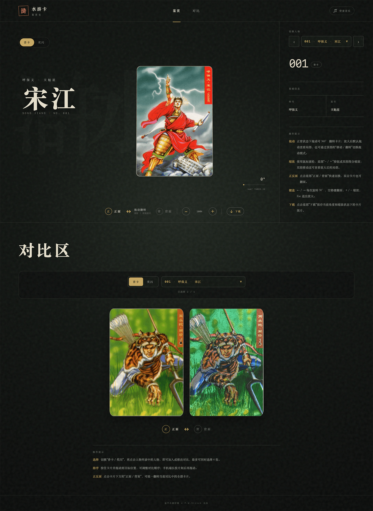

# 水浒卡鉴赏室

一个用于展示小浣熊水浒卡的响应式网站，提供卡片正反面鉴赏、基于 Three.js 的 3D 旋转与缩放、多版本卡片对比等功能，并支持 PC 端键盘操作及移动端触控交互。

项目页面与交互由作者设计，并借助 AI 完成代码实现，涵盖素材整理、组件化重构、Three.js 交互、性能优化、自动化测试和线上部署等环节。

在线体验：[https://pwstrick.github.io/water-card/](https://pwstrick.github.io/water-card/)


## 页面预览

| PC 端 | 移动端 |
| --- | --- |
| [](demo/water-pc.png) | [](demo/water-mobile.png) |

## 功能

- 收录普卡、奖闪、冷烫、立绘四类卡片，以及 108 位好汉、6 大恶人和扩展人物资料
- 普卡提供 108 位好汉和 6 大恶人，冷烫额外收录异画、特卡和赠卡，立绘额外收录恶人卡和特卡
- 四类卡片均直接呈现原始卡图，鉴赏区和对比区都不叠加人工反光或闪光效果
- 支持拖动旋转、惯性、缩放、局部平移和正反面切换的 3D 卡片预览
- 支持放大后的移动 / 翻转模式切换，以及当前角度预览图下载
- 最多选择 6 张卡片进行正反面对比、拖动排序、同人物跨栏目对比和一键清空
- 支持中文、拼音和拼音首字母检索，以及完整键盘操作
- 支持移动端单指旋转、双指缩放和平移，并针对 UC 浏览器提供布局兼容
- 图片加载失败时自动退避重试，耗尽次数后可手动重试
- 提供《好汉歌》背景音乐开关

## 技术栈

- React 19
- Vite 8
- Tailwind CSS 4
- Three.js
- dnd-kit
- Vitest + Testing Library

## 本地开发

建议使用 Node.js 24，最低版本要求为 Node.js 20.19+ 或 22.12+。

```bash
npm install
npm run dev
```

开发服务器默认运行在 `http://localhost:5175`。

其他常用命令：

```bash
npm test          # 运行单元测试
npm run test:watch # 监听文件变化运行测试
npm run build     # 构建生产版本
npm run preview   # 预览构建结果
```

## 项目结构

```text
public/assets/standard/      普卡及恶人卡图
public/assets/flash_prize/   奖闪卡图
public/assets/code_perm/     冷烫卡图
public/assets/character_art/  立绘卡图
src/components/card-viewer/  Three.js 场景、运动、输入和截图导出
src/components/comparison/   多卡对比区域
src/components/common/       通用交互组件
src/components/viewer/       鉴赏区页面编排
src/hooks/                   列表框、图片重试等状态逻辑
src/config/                  卡图裁切、展示和操作提示配置
src/data/                    人物资料、卡片工厂、卡组和查询逻辑
src/utils/                   设备识别、搜索、图片与键盘工具
tests/                       单元测试
```

### Three.js 模块

鉴赏区将场景职责拆分为多个相互独立的模块：

- `threeCardScene.js`：创建并维护常驻的 renderer、camera 和场景生命周期
- `cardMotion.js`：管理旋转、惯性、缩放、平移和正反面判断
- `cardInteraction.js`：统一处理鼠标、Pointer Events、滚轮和双指手势
- `cardSceneAssets.js`：创建卡片几何体、UV 裁切和纹理
- `exportCardImage.js`：使用临时 RenderTarget 导出当前画面
- `useCardViewer.js`：连接 React 状态与 Three.js 场景 API

切换人物时不会重建 WebGL renderer，只通过 `updateCard()` 替换卡面纹理、UV 几何体和材质。快速连续切换时使用请求版本号丢弃过期纹理，并显式释放不再使用的 GPU 资源。场景只渲染卡身、边缘和原始正反面纹理，不再创建奖闪专用 Shader 或额外反光 Mesh。

移动设备将 renderer pixel ratio 限制为 `1.5`，纹理 anisotropy 限制为 `4`，降低全屏浏览时的 GPU 填充和采样开销。

## 卡片数据

好汉和恶人的基础资料分别维护在 `src/data/heroes.js`、`src/data/villains.js`，卡组在 `src/data/collections.js` 中统一注册。`cardFactory.js` 负责生成编号、图片路径和卡片结构，`cardCatalog.js` 统一处理卡组查询、选择回退和同人物跨卡组查找。卡组数据只描述卡片内容和展示色调，不再注入奖闪视觉效果字段。每张卡图包含正反两面，具体裁切范围由 `src/config/cardImageLayouts.js` 配置。

当前冷烫和立绘卡组都采用横向合并图：正面在左、背面在右，两面等宽。冷烫图宽度为 1800px，WebP 质量为 90；立绘图宽度为 1800px，WebP 质量为 80。文件编号规则如下：

- `1.webp`～`108.webp`：108 位好汉
- `109.webp`～`114.webp`：6 大恶人
- `115.webp`～`130.webp`：异画卡，下拉框展示编号为 `异01`～`异16`，人物绰号和介绍沿用对应好汉
- `131.webp`～`142.webp`：特别卡，下拉框展示编号为 `特01`～`特12`，包含其他人物的绰号、简介和结局
- `143.webp`～`145.webp`：赠送卡，下拉框展示编号为 `赠01`～`赠03`，人物名为扈三娘，作者名维护在 `edition` 字段

立绘卡组维护在 `src/data/character_art.js`，数据结构参考冷烫卡组拆分为：

- `1.webp`～`108.webp`：108 位好汉，沿用 `heroes.js` 中的基础资料
- `112.webp`～`114.webp`：恶人卡，下拉框展示编号为 `恶01`～`恶03`，分别为西门庆、潘金莲、高衙内
- `115.webp`～`118.webp`：特卡，下拉框展示编号为 `特01`～`特04`，分别为朱富（`edition` 为“错版”）、琼英、阎婆惜、李师师

新增完整卡组时，建议将正反面合并后转换为 WebP，并按上述人物编号放入 `public/assets/<卡组目录>/`，然后创建对应的数据模块并注册到 `collections`。如果卡图的正反面比例、位置或留白与现有卡组不同，还需要在 `src/config/cardImageLayouts.js` 中增加独立的裁切配置。

## 对比区

对比区默认展示四个版本的解珍：普卡、奖闪、冷烫和立绘。用户可以继续通过下拉框多选人物，最多同时保留 6 张卡片。

对比区支持以下操作：

- 统一切换正面 / 背面
- 拖动卡片调整顺序
- 点击单张卡片后显示删除按钮，并以退出动画移出
- 点击“同人物对比”，以当前第一张卡片的人物名为基准，自动替换为其他栏目中的同名人物；没有同名卡的栏目会跳过
- 点击“清空对比区”，所有卡片会先淡出下沉，再清空列表

对比区接近视口时才动态加载组件、拖拽库和默认卡图。当前统一显示反面时，新加入的卡片会先以普通 2D 反面建立首帧，再在覆盖层下初始化 3D 双面结构，避免桌面浏览器短暂闪出正面。

奖闪与其他卡组使用相同的正反面展示流程，视觉差异完全来自原始图片素材。

## 测试

项目目前包含 21 个测试文件、72 项测试，主要覆盖：

- 卡片数据生成、编号、裁切布局和卡组查询
- 中文、拼音、拼音首字母搜索和列表框键盘交互
- 图片自动重试、手动重试及 timer 清理
- 卡片运动边界、旋转方向和缩放状态
- WebGL 场景常驻、纹理竞态和 GPU 资源释放
- 对比区选择上限、排序、同人物对比和删除动画
- 新卡首次显示当前正反面的渲染过程

提交改动前建议至少运行：

```bash
npm test
npm run build
```

构建时 Vite 会提示 Three.js 独立 chunk 超过默认的 500KB 阈值。Three.js 已通过 `React.lazy()` 与主包分离，该提示目前是已知的体积提醒。

## 部署

### GitHub Pages

推送到 `main` 分支后，GitHub Actions 会依次完成测试、构建、产物上传和 Pages 部署。GitHub Pages 使用 `/water-card/` 作为资源基础路径。

### EdgeOne Pages

EdgeOne 使用相同代码构建，建议配置如下：

- Node.js：24
- 安装命令：`npm ci`
- 构建命令：`npm run build`
- 输出目录：`dist`
- 环境变量：`DEPLOY_TARGET=edgeone`

设置 `DEPLOY_TARGET=edgeone` 后，Vite 会使用 `/` 作为资源基础路径，使网站可以直接部署在独立域名根目录。
